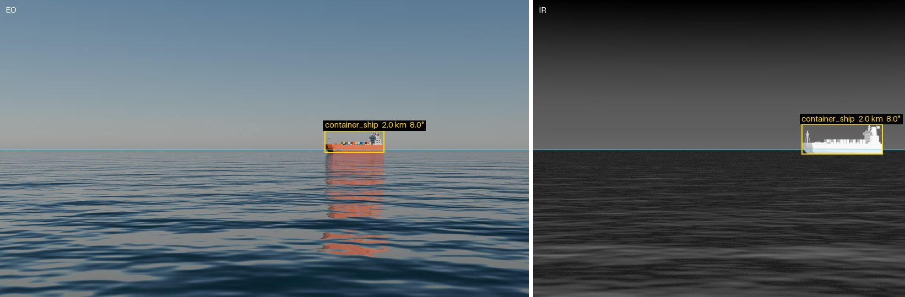

<h1 align="center">seascape</h1>

<p align="center">
  <em>Maritime scene generator for sensor validation. Multi-camera rigs, EO/LWIR, exact ground truth.</em>
</p>

<p align="center">
  <a href="https://github.com/kevinconka/seascape/actions/workflows/ci.yml"></a>
  <a href="LICENSE"></a>
  <a href="pyproject.toml"></a>
  <a href="https://www.blender.org/"></a>
  <a href="https://github.com/astral-sh/ruff"></a>
</p>

<p align="center">
  
  <br>
  <sub><code>scenarios/baseline.toml</code> in both bands, with its <code>labels.json</code> drawn on (<a href="docs/hero.py"><code>docs/hero.py</code></a>).</sub>
</p>

Real footage can't put a vessel at exactly 7 NM, hold the visibility constant, or show you the same ship from eight aspects. `seascape` renders maritime scenes where you choose all of that, and tells you exactly where everything was.

## Highlights

- **Ground truth by construction.** Rigs are built from code, so camera extrinsics and intrinsics are known rather than estimated. Every frame comes with each target's box, range and bearing, and the horizon.
- **LWIR as well as EO.** Thermal scenes use measured seawater optical constants, emissivity averaged over the wave slopes, and a band-integrated sky. Path extinction is not modelled, the atmospheric profile is fixed, and waves neither occlude nor shadow each other. Good enough to look at and to regression-test against, but not a radiometric reference: a detection-range or contrast figure taken off a render needs review before anyone acts on it.
- **Multi-sensor rigs.** Several cameras, each with its own resolution, optics and modality, in one scene with known relative geometry.

## Install

Blender ships as a Python package, so there is nothing else to install.

```bash
git clone https://github.com/kevinconka/seascape.git
cd seascape
uv sync
```

Only touching the radiometry or the scenario config? `uv sync --no-group blender` skips the Blender wheel, hundreds of MB. Those parts are plain NumPy and run without it.

Meshes are never committed. `seascape/assets.toml` records each one's source, sha256, licence and credit; they download on first use to `~/.cache/seascape`, or to `$XDG_CACHE_HOME/seascape` when that is set to an absolute path. Every run re-checks the digest.

## Quickstart

```bash
uv run seascape render scenarios/baseline.toml -o out/
```

That writes one image per camera, `calibration.json` and `labels.json` to `out/`. To open the scene in Blender instead, `seascape build` writes the `.blend`:

```bash
uv run seascape build scenarios/baseline.toml            # scenarios/baseline.eo.blend
uv run seascape build scenarios/baseline.toml -o /tmp/look.blend
```

## Scenarios

A scenario is a TOML file describing the world, the platform, the sensors and the targets. `scenarios/baseline.toml` is the smallest one.

`--set` overrides any field for one run, as the TOML line it would be written as, presets included:

```bash
uv run seascape render scenarios/twin-pod.toml --set 'rig.pitch_deg = -5'
uv run seascape render scenarios/baseline.toml --set 'outputs.samples.eo = 8' --set 'sky.sun_elevation_deg = 5'
uv run seascape render scenarios/twin-pod.toml --set 'rig.pods = [{ preset = "port" }]'   # one pod
```

A variant worth keeping is a file, and `extends` makes it a diff:

```toml
extends = "twin-pod.toml"

[rig]
pitch_deg = -5.0
```

Scenarios carry a `#:schema` line, so editors with a TOML language server give you key completion, inline validation and hover docs. `seascape schema > schema/scenario.json` regenerates it from the models.

## Sequences

`outputs.duration_s` turns a scenario into a clip. Targets make `speed_mps` along their heading, the ownship follows `[ownship.roll]`, `[ownship.pitch]` and `[ownship.heave]`, and the sea evolves. `scenarios/underway.toml` has all three:

```bash
uv run seascape render scenarios/underway.toml -o out/   # out/<camera>/0000.png, ...
uv run seascape video out/                               # out/<camera>.mp4
```

`outputs.loop = true` makes a seamless clip: every period rounds to a whole fraction of `duration_s`. A looping target cannot be underway; give it a `drift`, as `scenarios/drifting.toml` does.

Every frame has its own entry in `calibration.json` and `labels.json`, stamped with `time_s`. `seascape video` paces the frames by it, so a clip re-encodes without re-rendering. The `.blend` from `seascape build` carries the motion as keyframes. `montage` and `panorama` take stills.

## Outputs

`labels.json` is the ground truth, in [COCO's detection format](https://cocodataset.org/#format-data): per frame, a box around each target with its range and bearing from the camera, the horizon, and what rendered it. FiftyOne reads the boxes and their fields as they are; the per-frame keys (`horizon_px`, `camera`, `band`, `time_s`) stay in the JSON:

```python
import fiftyone as fo

fo.Dataset.from_dir("out/", fo.types.COCODetectionDataset, data_path=".")
```

`seascape montage` lays a render out for review, one row per band, each frame captioned with its camera. It reads the images already written, so it needs no Blender and a layout can be redone without re-rendering:

```bash
uv run seascape render scenarios/twin-pod.toml -o out/
uv run seascape montage scenarios/twin-pod.toml -o out/   # out/montage.png
```

`seascape panorama` stitches each pod's frames, per band, from `calibration.json`:

```bash
uv run seascape panorama out/ --projection rectilinear --frame pod --ruler
```

## Blender MCP (optional)

Lets an AI agent inspect and edit whatever scene you have open in Blender. Rendering from the CLI never touches it, so skip this unless you want the interactive workflow.

1. **Add the connector.** In Claude Desktop: **Customize → Connectors**, search *Blender*, click **Add**. It's first-party, so there's no config file and no `.mcpb`.
2. **Install the Blender add-on.** Open the [add-on install page](https://www.blender.org/lab/mcp-server/#add-on) next to Blender and drag the install link onto the Blender window **twice**: the first drop allows the Blender Lab extension repository and the second installs the add-on.
3. **Start it.** In Blender: **Edit → Preferences → Add-ons**, find *BlenderMCP*, enable **start MCP server**. Then **Save Preferences**, or it's gone on restart.

Check it's listening:

```bash
lsof -nP -iTCP:9876 -sTCP:LISTEN
```

> [!WARNING]
> The add-on runs generated code in your Blender session with no sandbox, and the port is unauthenticated. Changes only persist when you save in Blender.

<details>
<summary>Troubleshooting</summary>

| Symptom | Cause |
|---|---|
| Add-on gone after restarting Blender | Preferences were never saved. Run **Save Preferences**, or enable auto-save. |
| "Online access must be enabled" | **Edit → Preferences → System → Network → Allow Online Access**. |
| Nothing listening on 9876 | Blender isn't running, or the add-on is disabled. MCP needs the GUI. |
| Listening, but the wrong scene answers | Another Blender instance bound the port first. Only one can hold it. |
| Dragging the link does nothing | Drop it twice: the first drop only registers the repository. |
| A guide tells you to run `uvx blender-mcp` | That's [`ahujasid/blender-mcp`](https://github.com/ahujasid/blender-mcp), a different community server. Both work; don't mix their instructions. |

</details>

## Contributing

`AGENTS.md` covers the conventions and the Blender traps to know before changing anything.

Install the hooks once, before your first commit:

```bash
uvx pre-commit install
```

That runs `ruff check --fix` and `ruff format` on what you staged. The rest of CI is these commands, all of which have to pass:

```bash
uvx ruff check .
uvx ruff format --check .
uvx ty check
uv run pytest
```

`uv run pytest --render` adds the render-drift checks. They need a GPU, CI never runs them, and they are the only thing that catches a sea or sky shader rendering wrong. Run them before touching that chain.

## Licence

MIT, see [LICENSE](LICENSE). Bundled 3D assets carry their own licences, recorded in `seascape/assets.toml`; some require attribution, which travels with any released dataset.

`seascape/data/water_nk.csv` is CC BY 4.0, from [Nalli et al. 2022](https://doi.org/10.6084/m9.figshare.19341533); the citation travels in the file's own header.
