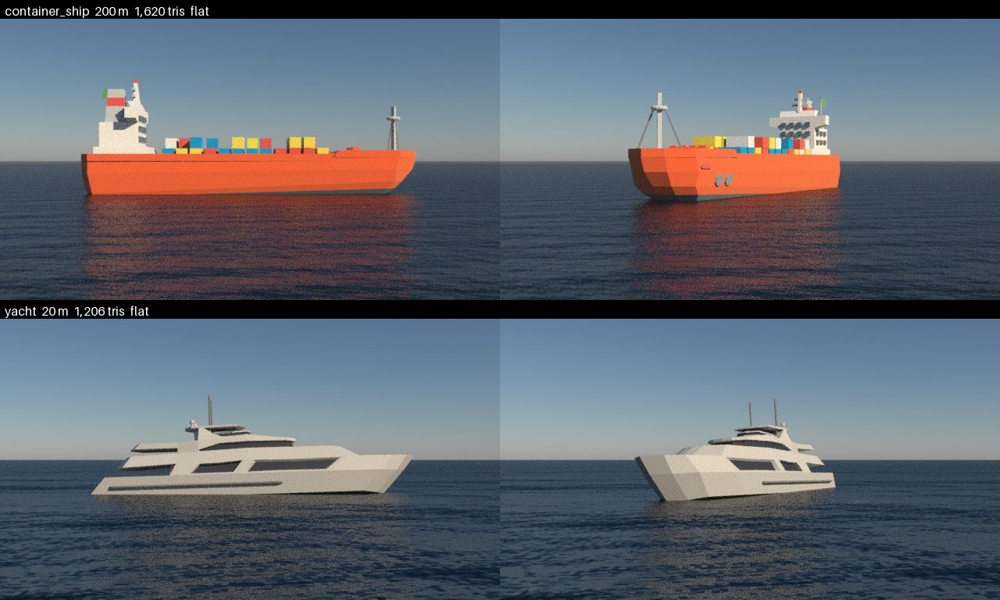

# Assets

`seascape assets` lists the meshes a scenario can name in `asset`, and the skies it can name in `sky.hdri`.

## Where a mesh may come from

A build downloads each mesh itself, so it needs a URL that anyone can fetch without logging in and that always returns the same bytes: one `.glb` or `.fbx` with its textures inside.

| Source | Licence | URL |
|---|---|---|
| [Objaverse](https://huggingface.co/datasets/allenai/objaverse) | Each model's own: take CC0 or CC-BY only | `resolve/<commit>/glbs/...`, pinned to a commit, never `main`; `object-paths.json.gz` maps a Sketchfab uid to its path |
| [Icosa Gallery](https://icosa.gallery) | CC-BY | `api.icosa.gallery/v1/assets/<id>`; skip `CREATIVE_COMMONS_BY_ND` |

Not usable:

- A non-commercial or no-derivatives licence.
- Sketchfab directly: its Download API needs an account and hands out links that expire.
- Poly Haven: every format it serves keeps its textures in separate files.

## Adding one

1. Find it in a source above and read its licence.
2. Download the file and run `uv run python docs/assets.py measure <file>`.
3. Add the entry to [`seascape/assets.toml`](../seascape/assets.toml) with those lines, the `url`, the `licence`, `attribution` with the author and the page, and a one-line `description` of what the camera sees.
4. Set `length_m` and `draught_m` from a real vessel of the class, citing it beside them.
5. Set `bow_deg` to where the bow points as authored, and check it in the sheet.
6. Regenerate the sheet with `uv run python docs/assets.py sheet docs/assets.jpg` and the schema with `uv run seascape schema > schema/scenario.json`, then run `uv run pytest --render`.

## Judging detail

A shape or texture smaller than a pixel cannot be seen. A camera whose pixel spans `ifov` radians sees a detail of `d` metres only while the range is under `d / ifov`. Lindstrom & Pascucci, "Visualization of Large Terrains Made Easy", IEEE Visualization 2001, Eq. 2, select terrain detail this way. A low-poly hull suits targets at range; an ownship or a close target needs textures and fine geometry.
